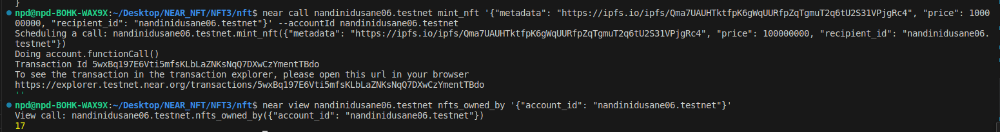
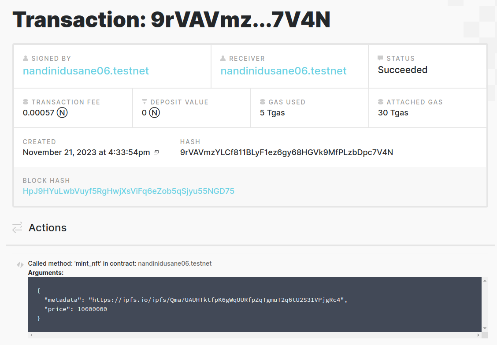

# Near_Blockchain_NFT
This is a NFT marketplace smart contract that allows minting NFTs on NEAR blockchain.

# Contract Functionality
1) mint_nft - Mint a new NFT with provided metadata, auto assign token_id, set initial price and list for sale
2) get_supply - Get total number of NFTs minted

# Some Key Features
1) Uses near_sdk and Rust lang
2) Metadata is stored on-chain
3) Owner ID is recorded for each NFT
4) Includes unique auto-incrementing token IDs
5) Leverages PanicOnDefault with custom new() method

# Important Links
Contract Deployment Link: https://explorer.testnet.near.org/transactions/5RFQYwUxYbURUKE3C9CN8J6Gn1CBrLDQLMpT33MocqHr

NFT Minting Link: https://explorer.testnet.near.org/transactions/9rVAVmzYLCf811BLyF1ez6gy68HGVk9MfPLzbDpc7V4N

NFT Hosting Link on IPFS: https://ipfs.io/ipfs/Qma7UAUHTktfpK6gWqUURfpZqTgmuT2q6tU2S31VPjgRc4

# Output Screenshots

